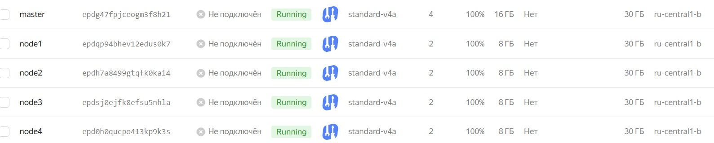
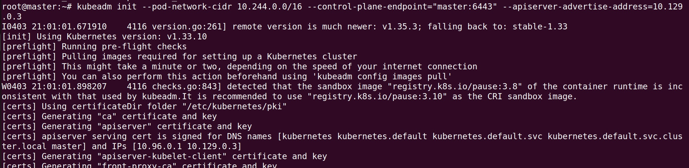
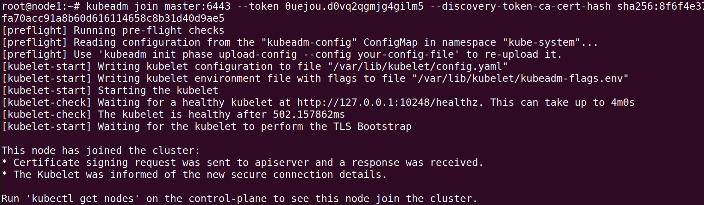
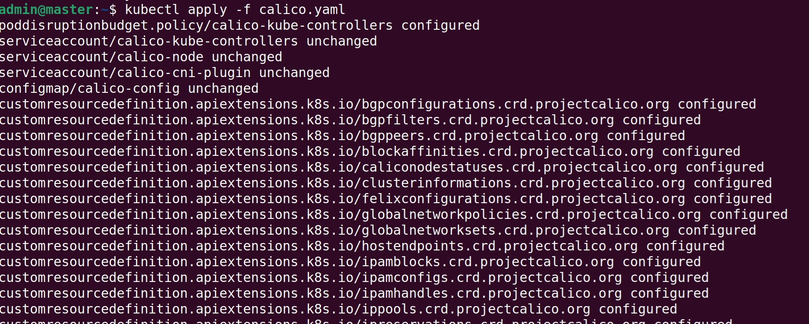
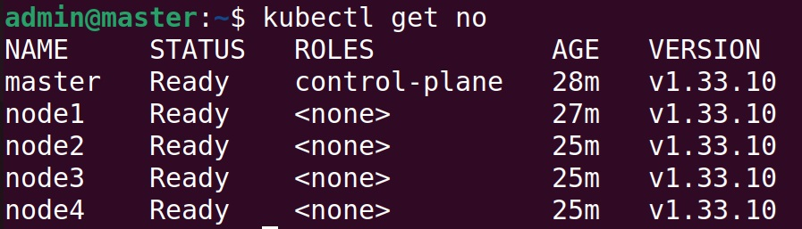

## Решение задания

Создание кластера из 5 нод, 1 мастер и 4 рабочие ноды:  

Инициализация мастера:  

Включение рабочих узлов:  

Установка cni плагина Calico:  

Вывод команды kubectl get no:  
